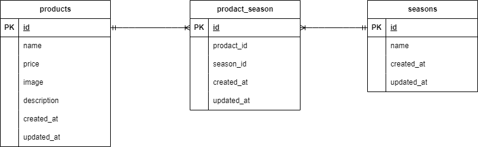

# 基礎学習ターム確認テスト\_もぎたて

## 環境構築

```
リポジトリからダウンロード
git clone git@github.com:pao590/tao-kadai2.git

```

.env ファイルの作成と設定
cp .env.example .env

```
DB_CONNECTION=mysql
DB_HOST=mysql
DB_PORT=3306
DB_DATABASE=laravel_db
DB_USERNAME=laravel_user
DB_PASSWORD=laravel_pass
```

Docker コンテナの構築と起動
docker-compose up -d --build

```
PHPコンテナ起動
docker-compose exec php bash
```

composer のインストール
composer install

```
アプリケーションキーの生成
php artisan key:generate

```

ストレージのシンボリック作成
php artisan storage:link

```
マイグレーションとシーディングの実行
php artisan migrate
php artisan db:seed

```
"The stream or file could not be opened"エラーが発生した場合srcディレクトリにあるstorageディレクトリ以下の権限を変更

chmod -R 777 storage


## 使用技術
- PHP 7.4.9
- Laravel 8.83.29
- MySQL 8.0.26
- Docker 27.4.0

## ER図


## URL
- 商品一覧：http://localhost/products
```
